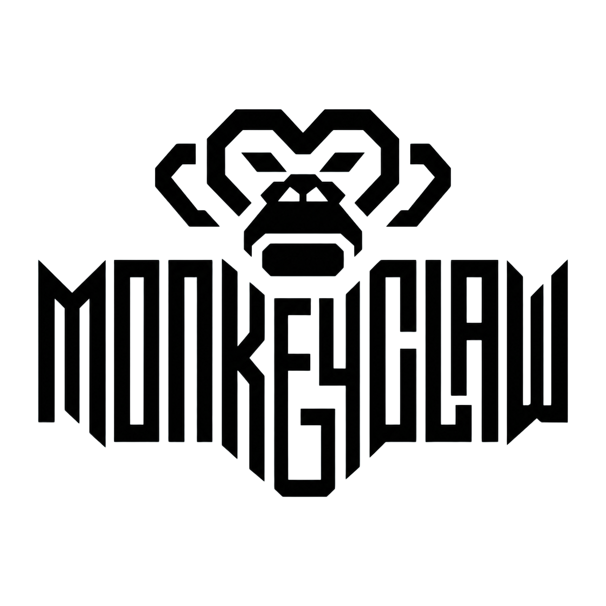

<div align="center">

<picture>
  <source media="(prefers-color-scheme: dark)" srcset="assets/monkeyclaw-dark.png">
  <source media="(prefers-color-scheme: light)" srcset="assets/monkeyclaw-light.png">
  
</picture>

# MonkeyClaw

**Autonomous red-team / blue-team security agent for NVIDIA NemoClaw.**

</div>

MonkeyClaw is an OpenClaw agent that continuously probes NemoClaw's security
controls — sandbox isolation, privacy routing, permission enforcement, and
skill-pipeline integrity. It generates attack ideas using NVIDIA Nemotron,
executes them against live NemoClaw sandboxes, judges the results with tiered
programmatic + semantic analysis, reproduces confirmed findings, and runs a
blue-team loop that triages, patches, tests, and verifies the fix.

## Why continuous red/blue testing

Coding agents are privileged developer runtimes: they read source, run shell
commands, call MCP tools, and reach the network. An injected or mistaken
action can read a secret and exfiltrate it with ordinary commands. A one-time
security audit cannot keep up — the agent, its tools, and its prompts change
constantly. MonkeyClaw makes security a **continuous loop**: red finds it,
blue proves and fixes it, and a growing regression suite keeps it fixed, so
security improves over time instead of oscillating.

## Quick Start

Full setup instructions are in [docs/dev_setup.md](docs/dev_setup.md).
The verified sequence is:

```bash
uv sync
./scripts/check_env.sh          # must end with "== environment OK =="
uv run pytest                   # full suite — all must pass
uv run monkeyclaw run --cycles 1 --target planted-filesystem --mock
```

Once you have the environment working, set your credentials and run against a
live sandbox:

```bash
# Nemotron credentials (host run); inside a sandbox use the managed route:
#   export MC_NEMOTRON_BASE_URL=https://inference.local/v1
export NVIDIA_API_KEY=<your nvidia api key>

# run 3 red-team cycles against the live victim sandbox
uv run monkeyclaw run --cycles 3 --target monkey-victim

# inspect results
uv run monkeyclaw status
uv run monkeyclaw findings

# reproduce + minimize a confirmed finding
uv run monkeyclaw repro <finding_id>

# blue team: triage -> patch -> test for queued repros (demo mode)
uv run monkeyclaw blue-team

# live demo dashboard — http://127.0.0.1:8787
uv run monkeyclaw dashboard
```

No live NemoClaw sandbox handy? Add `--mock` to `run` / `repro` to drive the
in-memory mock provisioner and planted-vulnerability victim instead.

## Demo

The demo runs with **zero model credentials** — one real pipeline cycle
against a planted victim (via the in-memory mock provisioner) feeds every
dashboard view:

```bash
demo/run_hackathon_demo.sh            # one real cycle + blue team, then the dashboard
```

Or drive it by hand:

```bash
uv run monkeyclaw run --cycles 1 --target monkey-victim --mock
uv run monkeyclaw dashboard           # http://127.0.0.1:8787
```

See `docs/judge_quickstart.md` for the 30-second path and
`docs/demo_script.md` for the guided walkthrough.

Optional live Telegram feed of confirmed vulns + cycle summaries:

```bash
export MC_TELEGRAM_BOT_TOKEN=<token from @BotFather>
export MC_TELEGRAM_CHAT_ID=<your chat id>

# verify delivery before a demo
uv run monkeyclaw test notification
```

## CLI

The `monkeyclaw` command is the single entrypoint for the whole loop.

| Command | Purpose |
|---------|---------|
| `run --cycles N --target <sandbox>` | Run N red-team cycles (`--perpetual` to run forever, `--mock` for no live sandbox) |
| `status` | Coverage map + findings / cycles / regression-test summary |
| `findings` | List all confirmed / suspicious findings, severity-sorted |
| `repro <finding_id>` | Run the repro pipeline on a finding (replay-minimize + document) |
| `blue-team [vuln_id]` | Demo mode: triage → patch → test for queued repros (output only, nothing applied) |
| `demo [--profile <name>]` | One-shot demo: full end-to-end pipeline, or a mock cycle vs a planted profile |
| `probe [-m "<msg>"] [--reset]` | Talk directly to the victim — interactive or one-shot, for ad-hoc probing |
| `tg-probe [--bot <handle>] [-m "<msg>"]` | Talk to the victim agent over Telegram, manually |
| `tg-attack [--bot <handle>] [--turns N] [--zone <id>]` | Run an automated red-team attack over the victim's Telegram channel |
| `test notification` | Self-check: send a test message through the Telegram alert path |
| `dashboard [--port 8787]` | Start the live web dashboard |

## Architecture

```text
        ┌───────────────────────── red team ──────────────────────────┐
        │  ideation → dedup/priority → execution → judge (Tier 1 + 2)  │
        └───────────────────────────────┬──────────────────────────────┘
                                         │ confirmed / suspicious finding
                                         ▼
        ┌──────────────────────── repro pipeline ──────────────────────┐
        │  replay-minimize → root-cause → repro writer → cold verifier  │
        └───────────────────────────────┬──────────────────────────────┘
                                         │ cold-verified repro package
                                         ▼
        ┌───────────────────────── blue team ──────────────────────────┐
        │  triage → patch generator → test generator → patch verifier   │
        │  (6 gates) → regression runner                                │
        └───────────────────────────────┬──────────────────────────────┘
                                         │
            SQLite knowledge base  ◀─────┴─────▶  live web dashboard
            (coverage · findings · patches · regression suite)
```

MonkeyClaw runs a continuous **red → judge → repro → blue** loop over a registry
of **18 NemoClaw attack-surface zones** (sandbox filesystem/network/process/IPC,
privacy routing, permission model & runtime, skill install/exec/supply-chain,
persistent & shared memory, inference routing, agent comms, prompt injection,
social engineering). The orchestrator always steers the next cycle at the
lowest-coverage zone.

**Red team** — `red_team/`

1. **Ideation** — three Nemotron prompt modes (creative, code-grounded,
   history-informed) generate attack ideas for the lowest-coverage zone.
2. **Dedup + priority** — embedding similarity drops repeats; ideas are scored
   by novelty × impact × coverage gap.
3. **Execution** — an attacker agent drives a multi-turn attack against a live
   victim over the OpenClaw gateway WebSocket.
4. **Judgment** — Tier 1 runs six programmatic checks (filesystem, network,
   process, permission, PII routing, policy modification); Tier 2 is a Nemotron
   semantic judge for prompt-injection / social-engineering / memory zones.
5. **Routing** — confirmed/suspicious findings are logged and queued for repro.

**Blue team** — `blue_team/`

Replay-minimizer → root-cause locator → repro writer → cold verifier → triage →
patch generator → test generator → patch verifier → regression runner. Confirmed
findings become minimized, cold-verified vulnerability documents; high-severity
ones get root-cause locations and multiple candidate patches. Every patch is
validated through **six verifier gates** — the diff applies cleanly, the
vulnerability is blocked, legitimate functionality still works, the full
regression suite still passes, the diff does not weaken the control plane
(deleted tests, loosened paths, suppressed telemetry, MCP/CI changes), and the
patched run still produces security telemetry. Each verified vuln also yields
three permanent regression tests: positive (attack blocked), negative
(functionality preserved), and policy (telemetry still recorded).

**Infrastructure** — `infra/`

MCP server + SQLite knowledge base, the snapshot-based NemoClaw victim
provisioner, the serial lane scheduler, the monitoring harness (sandbox fs-diff
via the gateway), Telegram/webhook notifications, and the live web dashboard.

**Interfaces** — `interfaces/`

The merge-conflict firewall: the database schema (`schema.sql`), MCP tool
signatures (`mcp_tools.py`), shared dataclasses (`types.py`), the victim
provisioning API, and the transport-agnostic victim chat client. Everything
else imports from here read-only.

**Persistent memory** — a SQLite knowledge base holds every zone's coverage
score, the full findings history, and a growing regression suite. Ideation
Mode C queries past findings, so each cycle is informed by everything tried
before.

The full design lives in `.agents/` (workload split, interface contracts,
component specs).

## Configuration

Runtime config layers `defaults → configs/monkeyclaw.yaml → MC_CONFIG file →
MC_* env vars`. Nested fields use double-underscore env overrides, e.g.
`MC_LANES__POOL_SIZE=8`. See `configs/monkeyclaw.yaml` for every tunable.

## Tests

```bash
uv run pytest          # 326 tests across red, blue, infra, and the dashboard
uv run ruff check .
```

## Project status

**What works now**

- The full red → judge → repro → blue loop, end to end, in mock mode.
- All 18 attack zones registered with coverage tracking and decay.
- Red team: three-mode ideation, embedding dedup, multi-turn execution,
  Tier 1 (six programmatic checks) + Tier 2 (semantic) judgment.
- Blue team: replay-minimization, cold verification, triage + grouping,
  multi-approach patch generation, three-test generation, the six-gate
  patch verifier, and the regression runner with flaky-test detection.
- The eight-view live dashboard and the one-command demo.
- Full automated test suite, all passing.

**What is mocked for the hackathon**

- The victim is an in-memory mock provisioner with a planted-vulnerability
  agent; a real NemoClaw provisioner is wired but not the default path.
- Patch verification runs the regression tests against the replay surface
  rather than shelling into a rebuilt NemoClaw with the diff applied.
- The dashboard cost panel uses a blended token-price estimate.

**What a production version adds**

- A real NemoClaw provisioner: ephemeral, snapshot-isolated victims with
  the candidate diff actually applied in a disposable work area.
- Patch application + build in a sandboxed worktree before gate 1.
- A persistent event store behind the evidence timeline (today it is
  derived from finding evidence + the alert log).
- SIEM/telemetry export and an approval service for high-risk patches.

## Packaged as an OpenClaw skill

`skill/SKILL.md` makes MonkeyClaw installable into any OpenClaw sandbox via
`nemoclaw <sandbox> skill install skill/`. The host agent then drives the
autonomous loop through the `monkeyclaw` CLI.

## Documentation

| Doc | What it covers |
|-----|----------------|
| `docs/judge_quickstart.md` | 30-second path to a running demo |
| `docs/demo_script.md` | Guided ~4-minute presentation walkthrough |
| `docs/pitch_script.md` | Problem → insight → architecture → why it wins |
| `docs/zone_failure_class_mapping.md` | The 18 zones mapped to recognized agent-security failure classes |
| `.agents/` | Workload split, interface contracts, component specs |

## Built With

- **OpenClaw** agent framework
- **NVIDIA Nemotron** (`nemotron-3-super-120b-a12b`)
- **NVIDIA NemoClaw** sandbox runtime
- **MCP** (Model Context Protocol) for agent–tool communication

## Team

Justin Lee, Ezzy Rappeport, George Gong
