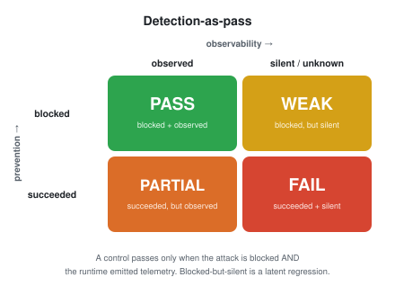
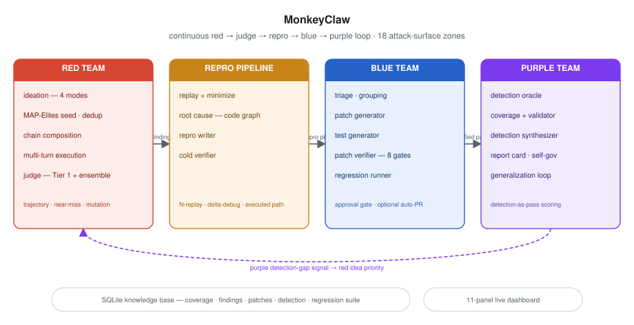

<div align="center">

<picture>
  <source media="(prefers-color-scheme: dark)" srcset="assets/monkeyclaw-dark.png">
  <source media="(prefers-color-scheme: light)" srcset="assets/monkeyclaw-light.png">
  
</picture>

# MonkeyClaw

**Autonomous red / purple / blue security agent for NVIDIA NemoClaw.**


</div>

MonkeyClaw is an OpenClaw agent that continuously probes NemoClaw's security
controls — sandbox isolation, privacy routing, permission enforcement, and
skill-pipeline integrity. It generates attack ideas with NVIDIA Nemotron,
executes them against live NemoClaw sandboxes, judges the results with tiered
programmatic + semantic analysis, reproduces confirmed findings, patches them,
and — the part most security tooling skips — checks that the *defense was
visible*: that NemoClaw's own telemetry fired when the control did its job.

## Why continuous red / purple / blue testing

Coding agents are privileged developer runtimes: they read source, run shell
commands, call MCP tools, and reach the network. An injected or mistaken
action can read a secret and exfiltrate it with ordinary commands. A one-time
security audit cannot keep up — the agent, its tools, and its prompts change
constantly. MonkeyClaw makes security a **continuous loop**: red finds it,
blue proves and fixes it, purple checks the fix is observable and stays fixed,
and a growing regression suite keeps it that way — so security improves over
time instead of oscillating.

The insight that drives the purple layer: **a blocked attack is not the same
as a working control.** A control that blocks an attack but emits no
telemetry "works today and regresses tomorrow undetected." MonkeyClaw scores
defense on two axes — *was the attack blocked* **and** *did the runtime say
so* — and only counts a control as passing when both are true. This is
**detection-as-pass**.

<div align="center">

<picture>
  <source media="(prefers-color-scheme: dark)" srcset="assets/detection-as-pass-dark.svg">
  <source media="(prefers-color-scheme: light)" srcset="assets/detection-as-pass-light.svg">
  
</picture>

</div>

## Quick Start

Full setup instructions are in [docs/dev_setup.md](docs/dev_setup.md).
The verified sequence is:

```bash
uv sync
./scripts/check_env.sh          # must end with "== environment OK =="
uv run pytest                   # full suite — all must pass
uv run monkeyclaw run --cycles 1 --target monkey-victim --mock
```

Once the environment works, set credentials and run against a live sandbox:

```bash
# Nemotron credentials (host run); inside a sandbox use the managed route:
#   export MC_NEMOTRON_BASE_URL=https://inference.local/v1
export NVIDIA_API_KEY=<your nvidia api key>

# run 3 red-team cycles against the live victim sandbox
uv run monkeyclaw run --cycles 3 --target monkey-victim

# inspect results
uv run monkeyclaw status
uv run monkeyclaw findings

# reproduce + minimize a confirmed finding
uv run monkeyclaw repro <finding_id>

# blue team: triage -> patch -> test for queued repros (demo mode)
uv run monkeyclaw blue-team

# live demo dashboard — http://127.0.0.1:8787
uv run monkeyclaw dashboard
```

NVIDIA/Nemotron is the default LLM provider. For local agent-harness runs,
commands that invoke the pipeline also accept `--claude`, `--codex`, or
`--opencode`, mapping to `claude --print`, `codex exec`, and `opencode run`
respectively. The same selection can be made with `MC_LLM_BACKEND`.

No live NemoClaw sandbox handy? Add `--mock` to `run` / `repro` to drive the
in-memory mock provisioner and planted-vulnerability victim instead. The
bootstrap also falls back to the mock provisioner automatically when the
`nemoclaw` CLI is not on `PATH`.

## Demo

The demo runs with **zero model credentials** — one real pipeline cycle
against a planted victim (via the in-memory mock provisioner) feeds every
dashboard view:

```bash
demo/run_hackathon_demo.sh            # one real cycle + blue team, then the dashboard
demo/run_hackathon_demo.sh --seeded   # backup: serve a checked-in DB fixture
```

Or drive it by hand:

```bash
uv run monkeyclaw run --cycles 1 --target monkey-victim --mock
uv run monkeyclaw dashboard           # http://127.0.0.1:8787
```

See `docs/judge_quickstart.md` for the 30-second path and
`docs/demo_script.md` for the guided walkthrough.

Optional live Telegram feed of confirmed vulns + cycle summaries:

```bash
export MC_NOTIFICATIONS__TELEGRAM_BOT_TOKEN=<token from @BotFather>
export MC_NOTIFICATIONS__TELEGRAM_CHAT_ID=<your chat id>

# verify delivery before a demo
uv run monkeyclaw test notification
```

## CLI

The `monkeyclaw` command is the single entrypoint for the whole loop.

| Command | Purpose |
|---------|---------|
| `run --cycles N --target <sandbox>` | Run N red-team cycles (`--perpetual` to run forever, `--mock` for no live sandbox) |
| `status` | Coverage map + findings / cycles / regression-test summary |
| `findings` | List all confirmed / suspicious findings, severity-sorted |
| `repro <finding_id>` | Run the repro pipeline on a finding (replay-minimize → root-cause → cold-verify) |
| `blue-team [vuln_id]` | Demo mode: triage → patch → test for queued repros (output only, nothing applied) |
| `demo [--profile <name>]` | One-shot demo: full end-to-end pipeline, or a mock cycle vs a planted profile |
| `probe [-m "<msg>"] [--reset]` | Talk directly to the victim — interactive or one-shot, for ad-hoc probing |
| `tg-probe [--bot <handle>] [-m "<msg>"]` | Talk to the victim agent over Telegram, manually |
| `tg-attack [--bot <handle>] [--turns N] [--zone <id>]` | Run an automated red-team attack over the victim's Telegram channel |
| `approvals [resolve <id> --allow\|--deny]` | List pending patch approvals; record a human decision |
| `test notification` | Self-check: send a test message through the Telegram alert path |
| `dashboard [--port 8787]` | Start the live web dashboard |

## Architecture

<div align="center">

<picture>
  <source media="(prefers-color-scheme: dark)" srcset="assets/architecture-dark.svg">
  <source media="(prefers-color-scheme: light)" srcset="assets/architecture-light.svg">
  
</picture>

</div>

MonkeyClaw runs a continuous **red → judge → repro → blue → purple** loop over
a registry of **18 NemoClaw attack-surface zones** (sandbox
filesystem/network/process/IPC, privacy routing & leakage, permission model &
runtime, skill install/exec/supply-chain, persistent & shared memory,
inference routing & local model, agent comms, prompt injection, social
engineering). The orchestrator steers each cycle at the lowest-coverage zone —
weighted by purple's detection-coverage gaps.

**Red team** — `red_team/`

1. **Ideation** — five prompt modes generate attack ideas for the
   lowest-coverage zone: creative, code-grounded, history-informed, **Mode D**
   — research-grounded ideation seeded by a preloaded 35-skill attack corpus
   (`red_team/attack_skills/`) — and **Mode E** — a systematic walk over the
   least-covered MITRE ATLAS / OWASP-LLM techniques. A MAP-Elites archive seed
   (elite recall + cross-cell recombination + empty-niche targets) is folded
   into the prompts.
2. **Dedup + priority** — embedding similarity drops repeats; ideas are scored
   by novelty × impact × coverage gap, boosted by purple's detection-gap
   signal and per-zone attack Elo.
3. **Chaining** — single-zone primitives compose into multi-zone kill chains;
   each chain runs in its own lane with capability-token preconditions.
4. **Execution** — an attacker agent drives a multi-turn attack against a live
   victim over the OpenClaw gateway WebSocket.
5. **Judgment** — Tier 1 runs six programmatic checks (filesystem, network,
   process, permission, PII routing, policy modification); Tier 2 is a
   five-role Nemotron judge ensemble (safety, progress, novelty, robustness,
   forensics) with disagreement-triggered frontier appeal and pairwise Elo.
6. **Search memory** — every attempt feeds trajectory/progress scoring,
   near-miss extraction, the mutation-operator bandit, and a labelled
   attempt-trace dataset for the learned ranker.

**Repro pipeline** — `blue_team/`

Confirmed/suspicious findings are replayed on N fresh victims and
delta-minimized. High-severity findings get a real **executed-path root
cause**: an anchor→sink BFS over a SQLite code graph, ranked by proximity,
centrality, and evidence touch. A structured repro document is written and
**cold-verified** by a fresh, context-free agent before it reaches blue team.

**Blue team** — `blue_team/`

Triage groups packages by zone/root cause; a patch generator produces
candidate diffs; a test generator writes positive, negative, and policy tests.
Every patch clears **eight verifier gates** — diff applies, vulnerability
blocked, blocked under ≤8 mutated attack variants, legitimate functionality
preserved, full regression suite passes, the diff does not weaken the control
plane (deleted tests, loosened paths, suppressed telemetry, MCP/CI edits), the
patched run still emits security telemetry, and — gate 8 — purple's detection
oracle confirms the defense is still **observed**, not silent.

**Purple team** — `purple_team/`

Purple is neither attacker nor patcher. It scores defense behavior. A derived-
evidence adapter turns monitoring side-effects into telemetry/decision
records; the **detection oracle** scores every execution into a
prevention × observability quadrant — `PASS` (blocked + observed), `PARTIAL`
(succeeded but observed), `WEAK` (blocked but silent), `FAIL` (succeeded +
silent). A coverage model folds verdicts into per-zone detection coverage; a
control validator re-runs the policy corpus against the live build and flags
regressions; a detection synthesizer turns confirmed findings into reusable
detection rules. A **7-dimension security report card** and a
**self-governance audit** (pointing the same machinery at MonkeyClaw's own
agents) summarize the posture. The feedback router pushes blind-spot signals
back into red priority and regression tasks into the blue queue.

After blue verifies a patch, the **generalization loop** mutates the original
attack and re-tests the patched victim against every variant; a surviving
bypass becomes a constraint that bounces the patch back for a re-patch round
(bounded, default 3 rounds).

**Infrastructure** — `infra/`

MCP server + SQLite knowledge base with a forward-only, ordinal-validated
migration runner (**19 migrations**), five queue state machines with atomic
transitions, per-role model routing with fallback chains and token/cost
accounting, the snapshot-based NemoClaw victim provisioner, the serial lane
scheduler, the monitoring harness, a severity-gated approval service with an
append-only audit log and optional `gh`-CLI auto-PR, Telegram/webhook
notifications, and the live web dashboard.

**Interfaces** — `interfaces/`

The merge-conflict firewall: the database schema (`schema.sql`), MCP tool
signatures (`mcp_tools.py`), shared dataclasses (`types.py`), the model router,
the victim provisioning API, and the transport-agnostic victim chat client.
Everything else imports from here read-only.

**Persistent memory** — a SQLite knowledge base holds every zone's coverage
score (attack *and* detection axes), the full findings history, the MAP-Elites
archive, mutation-operator stats, judge votes, model-run costs, and a growing
regression suite. Ideation Mode C queries past findings, so each cycle is
informed by everything tried before.

The full design lives in `.agents/` (workload split, interface contracts) and
`docs/superpowers/` (the 17 upgrade specs and their implementation plans).

## How MonkeyClaw got here

The system shipped as a working red→judge→repro→blue scaffold, then took
**17 design specs** through a plan-and-execute process, sequenced into four
dependency-ordered waves (see `docs/superpowers/specs/`):

- **Wave 0 — Foundation:** data-integrity & migrations (the migration runner +
  queue FSMs), model routing.
- **Wave 1 — Enablers:** purple team, real NemoClaw provisioner, MAP-Elites
  archive, trajectory & progress scoring, mutation-operator learning, judge
  ensemble, corpus-driven ideation, real root-cause analysis.
- **Wave 2:** model-ideation tournament, cross-zone attack chaining,
  verifier-gate hardening, real patch isolation.
- **Wave 3:** patch-generalization loop, learned ranking model, approval & PR
  service.

## Configuration

Runtime config layers `defaults → configs/monkeyclaw.yaml → MC_CONFIG file →
MC_* env vars`. Nested fields use double-underscore env overrides, e.g.
`MC_LANES__POOL_SIZE=8`. See `configs/monkeyclaw.yaml` for every tunable —
including the `models:` per-role routing table, `purple:` toggles, and the
`red:`/`blue_team:` feature gates.

Several capabilities are wired but **gated off by default** so the
zero-credential demo path stays deterministic: the model-ideation tournament
(`model_tournament.enabled`), the frontier judge appeal
(`red_team.judge.appeal.enabled`), the learned ranker (`red.ranker.mode` —
heuristic by default), real patch isolation (`blue_team.patch_isolation.enabled`),
and auto-PR (`approvals.auto_pr`).

## Tests

```bash
uv run pytest          # 1000+ tests across red, purple, blue, infra, migrations, dashboard
uv run ruff check .
```

## Project status

**What works now**

- The full red → judge → repro → blue → purple loop, end to end, in mock mode.
- All 18 attack zones registered with dual-axis (attack + detection) coverage
  tracking and decay.
- Red team: four-mode ideation, MAP-Elites archive, embedding dedup,
  cross-zone chaining, multi-turn execution, Tier 1 (six programmatic checks)
  + Tier 2 (five-role ensemble) judgment, trajectory/near-miss scoring, the
  mutation-operator bandit, and attempt-trace collection.
- Purple team: detection oracle, coverage model, control validator, detection
  synthesizer, the 7-dimension report card, self-governance audit, and the
  post-patch generalization loop.
- Blue team: replay-minimization, real executed-path root cause, cold
  verification, triage, multi-approach patch generation, three-test
  generation, the eight-gate patch verifier, the severity-gated approval
  service, and the regression runner.
- Versioned migration runner (19 migrations), five atomic queue state
  machines, per-role model routing with cost accounting.
- The eleven-panel live dashboard and the one-command demo.
- Full automated test suite, all passing.

**What is mocked for the hackathon**

- The default demo victim is an in-memory mock provisioner with a
  planted-vulnerability agent; the real NemoClaw provisioner is fully
  implemented and is the bootstrap default when the `nemoclaw` CLI is present.
- Patch verification runs against the replay surface unless
  `blue_team.patch_isolation.enabled` is set, which builds the diff into a
  disposable git worktree + rebuilt victim.
- The dashboard cost panel uses the configured per-Mtok token-price table.

**What a production version adds**

- A PostgreSQL + pgvector backend for cross-lane concurrency.
- Object storage for transcripts/artifacts and signed, immutable audit logs.
- A trained learned ranker (the heuristic ranker ships day one; trace
  collection feeds an offline trainer behind a dataset-readiness gate).
- SIEM/telemetry export and a hardened approval service for high-risk patches.

## Packaged as an OpenClaw skill

`skill/SKILL.md` makes MonkeyClaw installable into any OpenClaw sandbox via
`nemoclaw <sandbox> skill install skill/`. The host agent then drives the
autonomous loop through the `monkeyclaw` CLI.

## Documentation

| Doc | What it covers |
|-----|----------------|
| `docs/judge_quickstart.md` | 30-second path to a running demo |
| `docs/demo_script.md` | Guided ~4-minute presentation walkthrough |
| `docs/pitch_script.md` | Problem → insight → architecture → why it wins |
| `docs/monkeyclaw_full_architecture_report.md` | The full system architecture report |
| `docs/zone_failure_class_mapping.md` | The 18 zones mapped to agent-security failure classes |
| `docs/zone_detection_mapping.md` | Per-zone expected telemetry signatures (detection-as-pass) |
| `docs/superpowers/specs/` | The 17 upgrade specs + the wave roadmap |
| `.agents/` | Workload split, interface contracts, component specs |

## Built With

- **OpenClaw** agent framework
- **NVIDIA Nemotron** (`nemotron-3-super-120b-a12b` workhorse; `-nano` cheap
  tier; `-ultra` heavy tier; `nemotron-content-safety-reasoning-4b` safety judge)
- **NVIDIA NemoClaw** sandbox runtime
- **MCP** (Model Context Protocol) for agent–tool communication

## Team

Justin Lee, Ezzy Rappeport, George Gong
